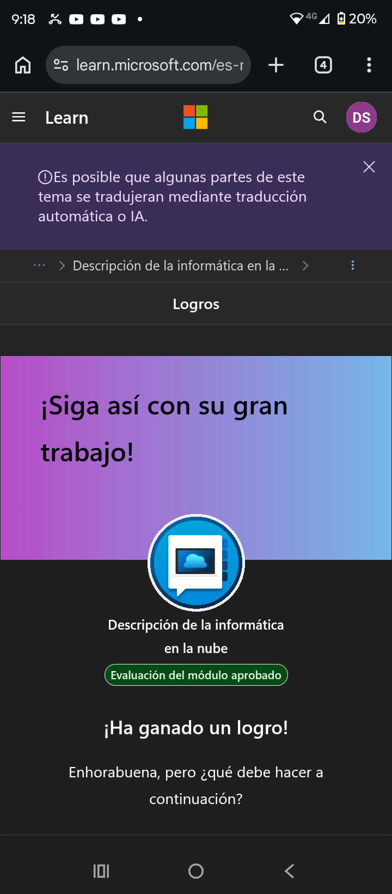

# Diplomas---Windows-
Mis logros de Microsoft azure## 
🏆 Mi Primer Logro 
Defina la informática en la nube.

Describir el modelo de responsabilidad compartida.

Defina modelos de nube, incluidos públicos, privados e híbridos.

Identifique los casos de uso adecuados para cada modelo de nube.

Describir el modelo basado en el consumo.

Comparar los modelos de precios de la nube.
